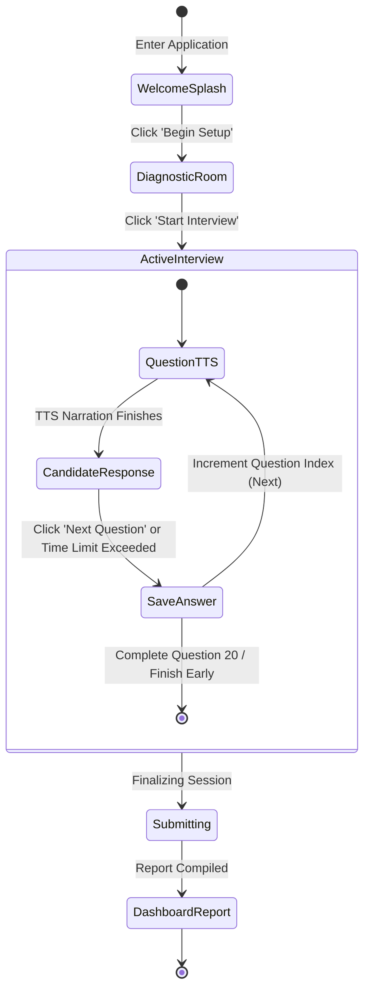
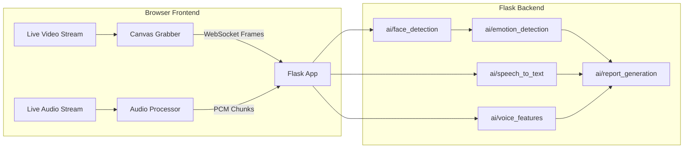

# AI Interview Analysis System - Workflow & Roadmap

This document outlines the interview workflow and maps out how the system transitions from the Phase 1 post-recording model validation to Phase 2 real-time streaming analysis.

---

## 1. Interview Workflow (Phase 1 & Future)

The user experience flow remains identical across all phases:

### Flow Components
1. **Welcome Splash**: Outlines rules, duration, and hardware requirements.
2. **Diagnostic Room**: Tests webcam and microphone tracks, and pings the backend connection.
3. **Active Interview**:
   * **Question Narration**: The system automatically reads the question aloud using `SpeechSynthesis`.
   * **Countdown/Response**: The circular visual timer alerts the candidate. If the timer hits `0`, it triggers `handleNext()` automatically.
   * **Recording & Upload**: In Phase 1, `MediaRecorder` packages video and audio tracks, and uploads the chunk on question progression.
4. **Dashboard Report**: Summarizes completed metadata and displays analytics metrics cards (AI processing indicators).

---

## 2. Transition Plan: From Recording to Real-Time AI

While Phase 1 records the interview to disk for development and verification, Phase 2 will introduce real-time pipelines processing webcam frames and microphone streams.

### Future Real-Time Streams Pipeline (Phase 2+)

### Technical Design for Live Tapping
To ensure this migration requires no major project refactoring, we have built the Phase 1 components to expose raw streams directly:
1. **Frontend Streams**:
   * The `useCamera` and `useMicrophone` hooks manage live `MediaStream` objects. The `<Webcam>` component already binds the camera stream to a `<video>` element and routes microphone analyser values to a Canvas context.
   * In Phase 2, a WebSocket manager service will tap into the same hooks, capturing canvas frame buffers at 15–30 fps and streaming them to backend WebSockets.
2. **Backend Services**:
   * The `backend/ai/` directories contain modular stub components with `process_frame()` and `process_audio_chunk()` helper stubs.
   * Developers can build AI models within these stubs without changing the endpoint managers (`app.py` or `interview_manager.py`).
   * The database schema stores metrics incrementally question-by-question rather than loading full files, matching the eventual output framework.
